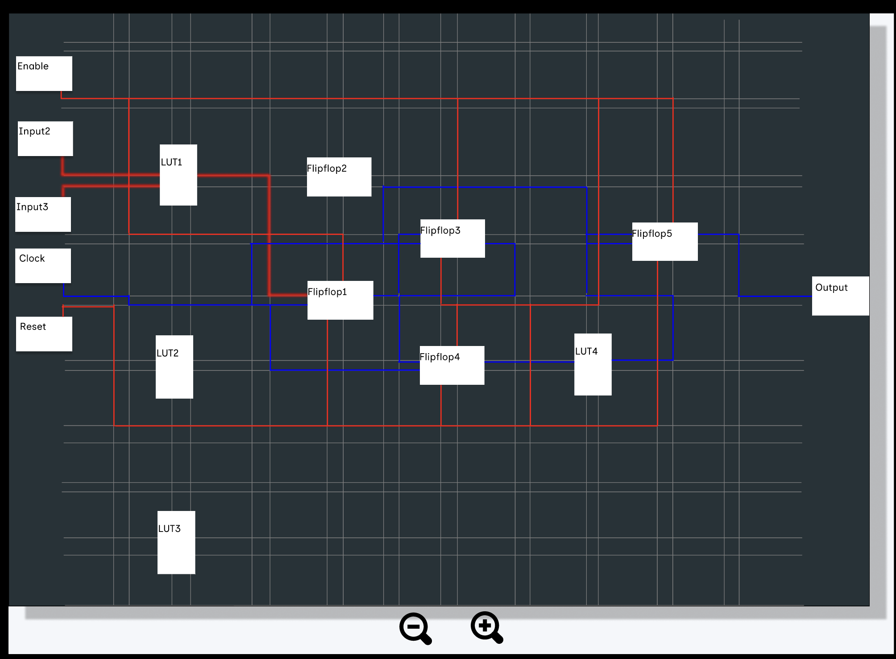
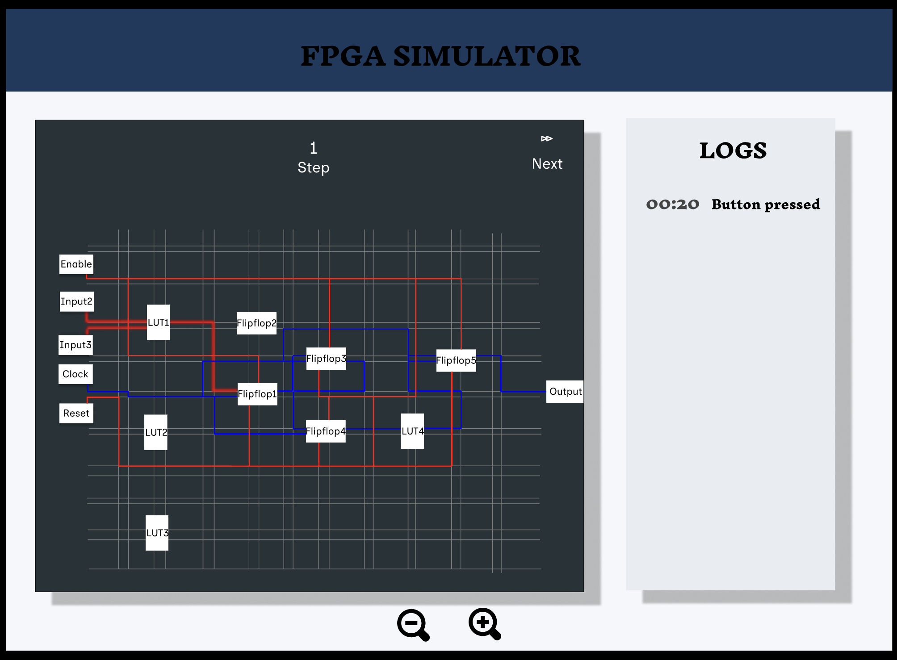
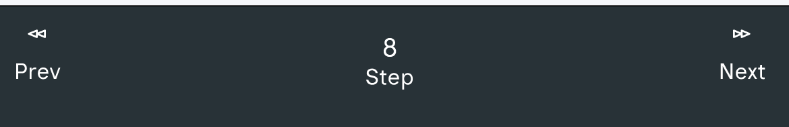
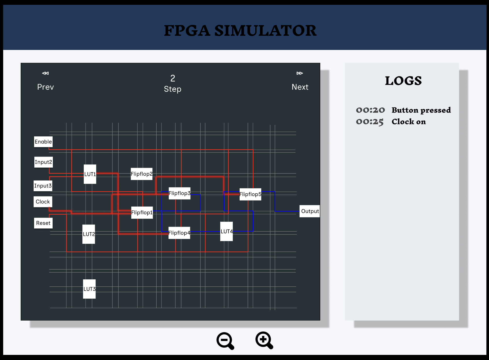
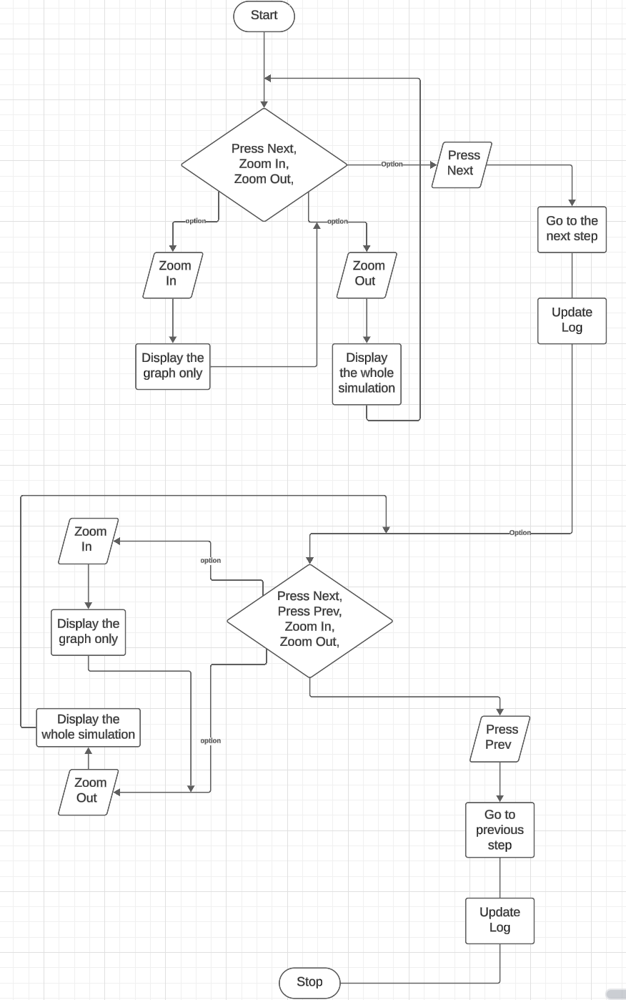

# Functional Specification Document 

---

Contents 📋

## Table of contents

---

## Web Interface for FPGA Simulator

## 1. Introduction

### 1.1 Purpose
This document outlines the functional specifications for a web interface that visualizes signal propagation inside an FPGA (Field-Programmable Gate Array). The primary purpose of this software is educational, allowing students to observe and understand how signals propagate through an FPGA's components on a user-friendly web interface.

### 1.2 Project Scope
The project involves developing a web application that:
- Displays a 2D representation of an FPGA's layout after synthesis and Place & Route (P&R)
- Animates signal propagation through the FPGA's Basic Elements (BELs) and interconnections
- Allows users to control simulation (next, prev)
- Provides navigation tools (zoom, pan) for exploring the FPGA layout
- Includes a backend system for teachers to add example applications and testbenches

### 1.3 Intended Audience
This specification is intended for:
- Development team responsible for implementing the web interface
- Teachers who will use the backend to create educational content
- Stakeholders reviewing the project requirements and deliverables
- Students who will interfere with the frontend to see how signal is flowing in an FPGA

## 2. System Overview

### 2.1 System Architecture
The system will consist of two main components:

1. **Frontend Web Interface**
  - Browser-based application for students
  - Interactive 2D visualization of FPGA layout
  - Simulation controls
  - Navigation tools for the 2D view

2. **Backend System**
  - Processing pipeline for verilog applications and testbenches
  - API for the frontend to access simulation data
  - Teacher interface for adding new examples

### 2.2 User Roles

#### 2.2.1 Student
Students will use the web interface to:
- Select from preloaded application examples
- View the 2D representation of the FPGA layout
- Control the simulation playback (play, pause, speed)
- Navigate the 2D view (zoom, pan)
- Observe signal propagation through the FPGA

#### 2.2.2 Teacher
Teachers will use the backend interface to:
- Upload verilog applications and testbenches
- Create educational content for students

## 3. Functional Requirements(FR)

### 3.1 Frontend Web Interface (Student Use)

#### 3.1.1 Application Selection
- **FR-1.1**: The interface will display a loaded application example.
- **FR-1.2**: Users shall be able to interact with no problem with the interface.

#### 3.1.2 2D Visualization
- **FR-2.1**: The interface shall display a 2D representation of the FPGA layout showing:
  - Basic Elements (BELs) used by the application
  - Signal routes between BELs
  - Current state of signals (active/inactive)
- **FR-2.2**: BELs shall be visually distinguishable by type (flipflop, LUT).
- **FR-2.3**: Signal routes shall be visible and distinguishable from BELs.
  - BELs shall be display in block, while signal shall be display in line.
    - **Flipflop:** Display in a horizontal rectangular form.
    - **LUT:** Display in a vertical rectangular form
    - **Signals:** Display in vertical and horizontal lines
- **FR-2.4**: Active signals shall be visually highlighted during simulation.
  - Inactive signals shall be display in gray(**color: #808080**)
  - Signal path from input to output shall be display in blue(**color: #0000FF**)
  - Current active signal state in the simulation shall be display is red with a layer shadow effect(**color: #FF0000**)

  

#### 3.1.3 Navigation Controls
- **FR-3.1**: Users shall be able to zoom in and out of the 2D view.
  - The zoom button with positive sign is for zoom in whereas the other one with negative sign is for zoom out
    

  - **ZOOM-IN:**
    

  - **ZOOM-OUT:**
     

- **FR-3.2**: Users shall be able to through the simulation process step by step around the 2D view.
    
  
  
  - **Steps:** Guide you to know where precisely at which level you are in the simulation
  - **Prev:** Permit you to see the previous step of the simulation
    
  - **Next:** Helps you to go to the next step of the simulation
    
  
#### 3.1.4 Simulation Controls
The simulation will be control manually, there will be no automatically display of current flow in the simulation. The **next and prev** button will be use t navigate throughout the simulation.

#### 3.1.5 Information Display
- **FR-5.1**: The interface shall display the current simulation time.
- **FR-5.3**: The interface shall provide information of what is happening at each step.
- **FR-5.4**: The interface may display a timeline of signal changes.
  

### 3.2 Program Flow
Both the flowchart and pseudo code represent the flow of the simulation process on the web interface.

#### 3.2.1 Flowchart

#### 3.2.2 Pseudo-code
    // Pseudo-code for FPGA Simulator with Zoom and Step Control

    // Define inputs
    Input2 = Input2
    Input3 = Input3
    Clock = Clock
    
    // Define LUT and Flip-flop
    LUT1 = CombinationalLogic(Input2, Input3)
    
    Flipflop1 = DFlipFlop(Clock, LUT1)
    Flipflop3 = DFlipFlop(Clock, Flipflop1)
    
    // Initialize simulation state
    CurrentStep = 0
    ZoomLevel = 1  // 1 represents normal view, >1 represents zoomed-in
    
    // Simulation steps
    InitializeComponents()
    
    While (SimulationRunning) {
      If (ButtonPressed) {
        Log("Button pressed")
    
        If (Button == "ZoomIn") {
            ZoomLevel += 1
        } Else If (Button == "ZoomOut") {
            If (ZoomLevel > 1) {
                ZoomLevel -= 1
            }
        } Else If (Button == "Next") {
            If (ClockEdgeDetected) {
                Log("Clock on")
                UpdateFlipFlops("Next")
                CurrentStep += 1
            }
        } Else If (Button == "Prev") {
            If (CurrentStep > 0) {
                UpdateFlipFlops("Prev")
                CurrentStep -= 1
            }
        }
      }

      Log("Output")
    }
    
    // Function Definitions
    Function CombinationalLogic(inputs) {
      // Define the logic for LUTs based on inputs
      Return logic_output
    }
    
    Function DFlipFlop(Clock, Input) {
      If (ClockEdgeDetected) {
        Return Input
      }
      Return PreviousState
    }
    
    Function UpdateFlipFlops(direction) {
      If (direction == "Next") {
        Flipflop1.Update(LUT1)
        Flipflop3.Update(Flipflop1)
        Log("Flipflop1 updated")
        Log("Flipflop3 updated")
      } Else If (direction == "Prev") {
        // Revert flip-flop states to previous step
        RevertFlipFlopStates(CurrentStep)
        Log("Reverted to previous state")
      }
    }
    
    Function DisplayWithZoom(zoomLevel) {
      // Adjust display based on zoom level
      ApplyZoom(zoomLevel)
    }
    
    Function ApplyZoom(zoomLevel) {
      // Implement zoom functionality
      AdjustDisplayScale(zoomLevel)
    }

**📕NB:** This mockup images is the first version of our simulation representing how the interface will be display, but some slight modification shall be made during the
implementation phase. Here under are keypoint to take into consideration during the implementation phase.

- **Improve View Clarity:**
  - Wires between elements will be grouped horizontally and vertically to maintain a clean and organized layout.
  - Elements like **Enable and Reset** will be removed to improve clarity,

- **Element Identification:**
  - Row and column numbers will be placed on the borders for element identification, avoiding placement inside the elements to prevent display clutter.

- **Refine Transition Animation:**
  - The transition animation will be refined to accurately represent signal propagation through the wires. The blur effect will be adjusted to better illustrate signal movement. Instead of using only the red color, a mix of red and green color of 1mm each on active signal line.

- **Distinguish Input/Output Elements:**
  - Input and output elements will be treated as distinct entities, similar to flip-flops and LUTs. They will not be mixed with names like clock, enable, or reset to maintain clear categorization.

- **Comprehensive Log Information:**
  - The log will be expanded to include all clock edges and BLEs information whether they are **on or off**, to provide a complete understanding of signal movement within the FPGA.

### 3.3 Backend System (Teacher Use)

#### 3.3.1 Application Upload(Synthesis)
- **FR-1.1**: Teachers shall be able to upload verilog application files.
- **FR-1.2**: Teachers shall be able to upload an SDF file.
- **FR-1.3**: The system shall validate uploaded files for format correctness.
- 
#### 3.3.2 Processing Pipeline(Place)
- **FR-2.1**: The system shall then convert the files format into a pivot file format accessible by the frontend.
- **FR-2.2**: The backend shall process the converted files to generate required simulation data.
- **FR-2.3**: The backend shall calculate signal propagation timing in milliseconds.

#### 3.3.3 Pre-Visualization(Root)
- **FR-3.1**: The backend shall generate a 2D representation of the FPGA layout from the processed data pinpointing the different
BLEs that will be used for the signal propagation.

#### 3.3.3 Example Management
- **FR-3.1**: Teachers shall be able to upload verilog and SDF files.
- **FR-3.3**: Teachers shall be able to remove examples from the system.

#### 3.3.4 Intermediary File Format
- **FR-4.1**: The system shall define an intermediary pivot file format to bridge between backend processing and frontend visualization.
- **FR-4.2**: The format shall include:
  - Module Name: The name of the Verilog module
  - Signal information, names, types of input and output, and signal values
  - Signal propagation timing data
  - Simulation event sequence about the clock signal

### 4. Use Cases

#### 4.1 Use Case: Running a Simulation
| **Use Case ID** | UC-01                                                                   |
|----------------|-------------------------------------------------------------------------|
| **Actors** | Student                                                                 |
| **Preconditions** | The teacher has preloaded an application example.                       |
| **Description** | The student runs the simulation.              |
| **Postconditions** | The FPGA layout is visualized, showing signal propagation in blue color. |
| **Alternative Flows** | Student prev/next/zoom in/out the simulation mid-run.                   |

#### 4.2 Use Case: Uploading a Verilog Application
| **Use Case ID** | UC-02                                                                                   |
|----------------|-----------------------------------------------------------------------------------------|
| **Actors** | Teacher                                                                                 |
| **Preconditions** | The teacher has a Verilog file and SDF file.                                            |
| **Description** | The teacher uploads the files, which are processed into a pivot file for visualization. |
| **Postconditions** | The application is available for students.                                              |
| **Alternative Flows** | System rejects incompatible files and provides error messages.                          |

### 5. Personas

#### 5.1 Persona: Alex (The Student)
- **Role:** Engineering Student
- **Experience:** Basic digital electronics knowledge

- **Goals:**
  - Understand FPGA signal propagation
  - Visualize routing mechanisms
  - Practice with different examples
  - Self-paced learning

- **Pain Points:**
  - Abstract concepts difficult to grasp
  - Limited hands-on experience
  - Need for interactive learning tools

#### 5.2 Persona: Dr. Smith (The Teacher)
- **Role:** FPGA Course Instructor
- **Experience:** 15+ years teaching digital electronics

- **Goals:**
  - Upload and manage FPGA examples
  - Create comprehensive learning materials
  - Monitor student progress
  - Demonstrate complex FPGA concepts

- **Pain Points:**
  - Time-consuming setup of examples
  - Difficulty in explaining dynamic concepts
  - Limited visual tools for demonstration

## 6. Non-Functional Requirements

### 6.1 Performance Requirements
- **NFR-1.1**: The web interface shall load within 5 seconds on a standard broadband connection.
- **NFR-1.2**: The simulation animation shall run smoothly without noticeable lag.
- **NFR-1.3**: The system shall support at least 50 concurrent users.
- **NFR-1.4**: The simulation running time in between BLEs shall be similar to that on the SDF file

### 6.2 Usability Requirements
- **NFR-2.1**: The interface shall be intuitive and require minimal training for students.
- **NFR-2.2**: The interface shall be compatible with major web browsers (Chrome, Firefox, Safari, Edge).
- **NFR-2.3**: The interface shall be responsive and usable on devices with screens of at least 1024x768 resolution.
- **NFR-2.4**: The simulation shall run automatically.
- **NFR-2.5**: Minimize the learning curve for new users, especially students, to quickly understand and use the system effectively.
- **NFR-2.6**: The system ensure the web interface is accessible to users with disabilities, following relevant accessibility standards.

### 6.3 Reliability Requirements
- **NFR-3.1**: The system shall have an uptime of at least 99%.
- **NFR-3.2**: The system shall handle and recover mechanisms to manage unexpected issues gracefully.
- **NFR-3.3**: The system shall provide appropriate error messages for common issues.
- 

### 6.4 Security Requirements
- **NFR-4.1**: The backend shall implement authentication for both teacher and student access.
- **NFR-4.2**: The system shall validate all user inputs to prevent injection attacks.
- **NFR-4.3**: The system shall implement appropriate access controls to prevent unauthorized file access.
- **NFR-4.4**: The system shall implement a login page for both the teacher and student.
- **NFR-4.5**: Encrypt sensitive data both in transit and at rest to prevent unauthorized access.

### 6.5 Maintainability:

- **NFR-5.1**: Ensure the codebase is well-documented, modular, and follows best practices for ease of maintenance and future development.
- **NFR-5.1**: Implement a process for regular updates and patches to address bugs and security vulnerabilities.
- **NFR-5.1**: Use monitoring tools to track system performance and identify potential issues proactively.

## 7. Data Model

### 7.1 Entities and Relationships

  - **Application:** Represents a Verilog application that can be simulated.

  - **Attributes:** Application ID, Name, Description, Verilog Code, SDF Code.

  - **User:** The user will just run the simulation program, no login or authentification page needed.

  - **Simulation:** Represents a simulation run of an application.

  - **Attributes:** Simulation ID, Application ID, Timestamp, Status (e.g., Running, Completed).

  - **Netlist:**  Represents the netlist generated from an application.

  - **Attributes:** Netlist ID, Application ID, Verilog Netlist, SDF File.

### 7.2 Relationships
- A **Teacher** can upload an **SDF and verilog file**.
- A **Student** can run the **simulations** .
- Each **Simulation** is associated with a **Netlist**.

### 7.3 Data Flow
- **Teacher**: Uploads Verilog and SDF files to the backend. The backend processes these files to generate a pivot file(JSON file format).
- **Student**: Initiates a simulation, and views the results in the web interface.

## 9. Technical Implementation Considerations

### 9.1 Frontend Technologies
- Web framework options (React, Vue.js, Angular)
- Canvas rendering options (SVG, HTML5 Canvas, WebGL)
- UI component libraries

### 9.2 Backend Technologies
- Server-side programming language options
- Database options
- Processing pipeline integration options

### 9.3 Integration Points
- Integration with FPGA tools (`Impulse`, `yosys`, `VPR`)
- File format conversions (verilog, SDF)
- API endpoints for frontend-backend communication

## 13. Appendices

### 13.1 Glossary of Terms
- FPGA: Field-Programmable Gate Array, an integrated circuit with basic elements and preconfigured electrical signal routes between them. The selected FPGA is a NanoXplore NGultra (with VTR flow a basic Xilinx serie 7 model).
- BEL: Basic Element, the hardware electrical resources available inside the FPGA like flipflop, Look-Up-Table (LUT), Block RAM.
- Application: The function to be executed in the FPGA (developed in verilog).
- Synthesis: Translation of the application into an electrical equivalent. It creates a netlist. The tool used will be Impulse (or yosys in VTR flow).
- P&R: Place and Route, the packing of the netlist component in the FPGA available BEL (Place) followed by selection of routes for signals between each BEL (Route). The tool used will be Impulse (or VPR for VTR flow).
- Simulator: Compiles verilog testbenches and applications and executes the simulation of every signal with regard to time evolution. The tool used will be Modelsim (using icarus verilog for VTR flow).
- Software: The web application developed in the frame of this call for tender.

### 13.2 References
- DigitalJS project: https://digitaljs.tilk.eu/
- Verilog to routing: https://github.com/verilog-to-routing/vtr-verilog-to-routing
- OSSCAD project: https://github.com/YosysHQ/oss-cad-suite-build
- YoWASP: https://yowasp.org/
- Python SDF-timing library: https://github.com/chipsalliance/f4pga-sdf-timing