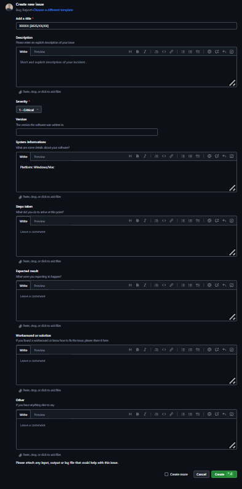
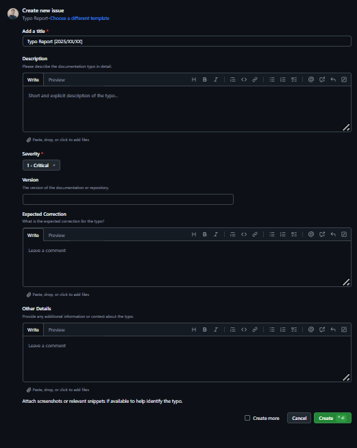
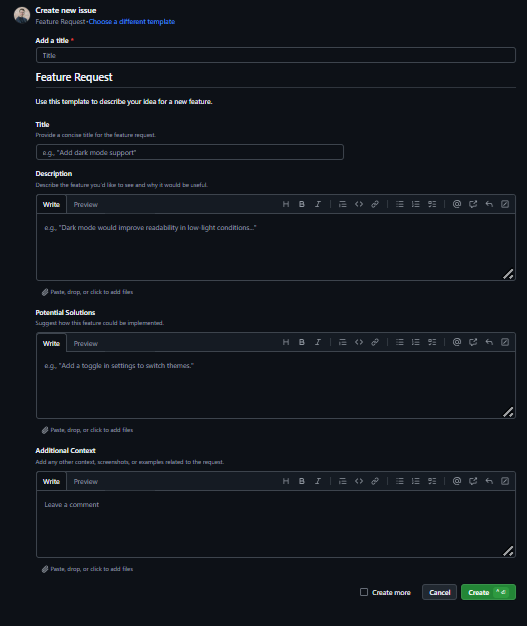
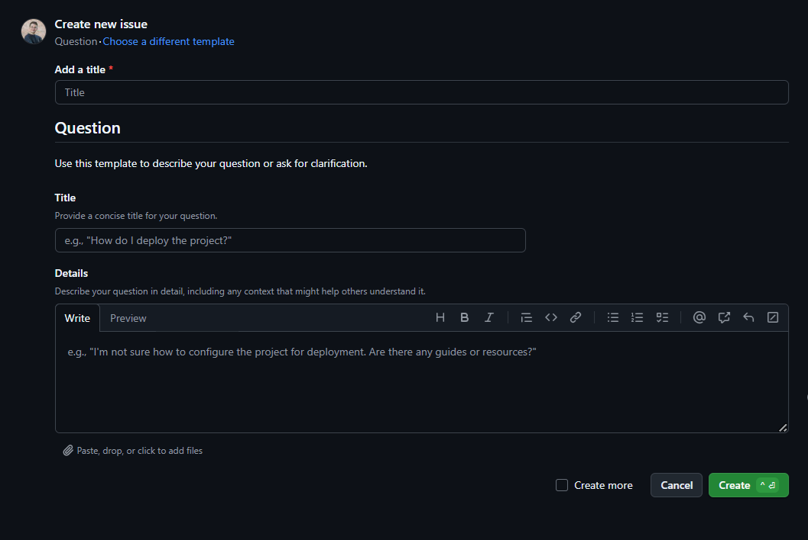
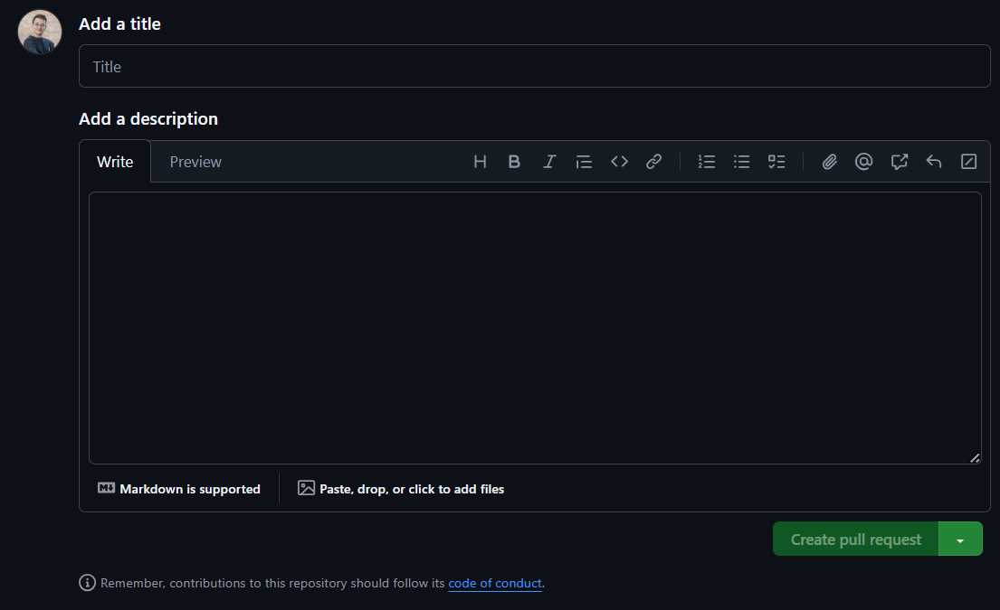

# Test Plan for oroject 4: Web FPGA Interface

Table of Contents

- [Test Plan for oroject 4: Web FPGA Interface](#test-plan-for-oroject-4-web-fpga-interface)
  - [1. Introduction](#1-introduction)
    - [1.1 Purpose](#11-purpose)
    - [1.2 Scope](#12-scope)
    - [1.3 Test Objectives](#13-test-objectives)
  - [2. Test Items](#2-test-items)
    - [2.1 Software Components to be Tested](#21-software-components-to-be-tested)
    - [2.2 Test Deliverables](#22-test-deliverables)
  - [3. Test Strategy](#3-test-strategy)
    - [3.1 Test Types](#31-test-types)
  - [4. Test Environment](#4-test-environment)
    - [4.1 Hardware Requirements](#41-hardware-requirements)
    - [4.2 Software Requirements](#42-software-requirements)
    - [4.3 Test Data](#43-test-data)
  - [5. Test Criteria](#5-test-criteria)
    - [5.1 Acceptance Criteria](#51-acceptance-criteria)
    - [5.2 Exit Criteria](#52-exit-criteria)
  - [6. Test Design](#6-test-design)
    - [6.1 Test Case Structure](#61-test-case-structure)
    - [6.2 Test Categories](#62-test-categories)
      - [6.2.1 Functional Testing](#621-functional-testing)
      - [6.2.2 Performance Testing](#622-performance-testing)
      - [6.2.3 Algorithm Testing](#623-algorithm-testing)
      - [6.2.4 Edge Case Testing](#624-edge-case-testing)
    - [6.2 Templates and Labels](#62-templates-and-labels)
      - [6.2.1 Issue Templates](#621-issue-templates)
    - [6.3 Bug Tracking](#63-bug-tracking)
      - [6.3.1 Issues templates](#631-issues-templates)
        - [6.3.2 Pull-Request Templates](#632-pull-request-templates)
        - [6.3.3 Labels](#633-labels)
      - [6.4 Bug Database](#64-bug-database)
  - [7. Test Schedule](#7-test-schedule)
  - [8. Resources](#8-resources)
    - [8.1 Test Tools](#81-test-tools)
    - [8.2 Personnel](#82-personnel)
  - [9. Risks and Mitigations](#9-risks-and-mitigations)
    - [9.1 Performance Risk](#91-performance-risk)
    - [9.2 Data Integrity Risks](#92-data-integrity-risks)
  - [10. Glossary](#10-glossary)

---

## 1. Introduction

### 1.1 Purpose

This document defines the **test plan** for the **Web FPGA Interface** project, a web-based tool for visualizing FPGA signal propagation using Verilog `.sdf` files. The goal is to ensure **functional correctness**, **performance efficiency**, and **overall robustness**.

### 1.2 Scope

The test plan covers:

- **Frontend testing** (React + D3.js-based visualization)
- **Backend testing** (Node.js API, file handling, simulation execution)
- **Algorithm validation** (FPGA structure generation, signal propagation)
- **Performance testing** (large `.sdf` files, concurrent users)

### 1.3 Test Objectives

- Verify correct behavior of core functionalities (parsing, visualization, simulation)
- Validate algorithmic accuracy in signal propagation
- Ensure performance under heavy or complex inputs
- Test robustness with edge cases and invalid inputs

---

## 2. Test Items

### 2.1 Software Components to be Tested

- **Parser**: Converts `.sdf` files into structured `.json`
- **Transformer**: Refines parsed data into a readable format
- **Frontend**: Web UI built with React and D3.js
- **Backend**: Node.js server handling file uploads and simulation

### 2.2 Test Deliverables

- Functional, performance, and edge case test cases
- Test execution reports
- Bug tracking logs
- Final summary report

---

## 3. Test Strategy

### 3.1 Test Types

- **Functional Testing** – Verifies all features work as intended
- **Data Integrity Testing** – Ensures accurate `.sdf` parsing
- **Algorithm Testing** – Validates structure generation and signal logic
- **Performance Testing** – Measures stability and efficiency under load
- **Edge Case Testing** – Tests unusual or invalid conditions

---

## 4. Test Environment

### 4.1 Hardware Requirements

- Modern development machine with **≥16GB RAM**
- Sufficient disk space for `.sdf` file handling

### 4.2 Software Requirements

- [Vite](https://vite.dev/) (v5)
- [React](https://react.dev/) (v19)
- [D3.js](https://d3js.org/) (v7.9)
- [Node.js](https://nodejs.org/) (Latest LTS)

### 4.3 Test Data

- A set of **valid and invalid `.sdf` files** representing various FPGA configurations

---

## 5. Test Criteria

### 5.1 Acceptance Criteria

- System must **correctly** parse `.sdf` files and render visualizations
- Delays and signal logic must **match input values**
- UI should be **responsive and intuitive**
- All core features must be usable **without errors**

### 5.2 Exit Criteria

- All tests are **executed and passed**
- No **critical or high-priority issues** remain
- All functional requirements **are met**

---

## 6. Test Design

### 6.1 Test Case Structure

| **Field**           | **Description**                          |
| ------------------- | ---------------------------------------- |
| **Test Case ID**    | Unique identifier                        |
| **Description**     | Brief summary of what's being tested     |
| **Input Data**      | Required files, inputs or conditions     |
| **Procedure**       | Step-by-step guide to reproduce the test |
| **Expected Output** | Correct behavior or system response      |
| **Pass Criteria**   | What defines a successful outcome        |

### 6.2 Test Categories

#### 6.2.1 Functional Testing

| **Test Case ID** | **Test Case Description**                     |
| ---------------- | --------------------------------------------- |
| **Test Case 1**  | Verifying the UI interface format is correct. |
| **Test Case 2**  | Verifying the interface responsiveness.       |
| **Test Case 3**  | Testing the interface's accessibility.        |
| **Test Case 4**  | Testing the interface's features.             |
| **Test Case 5**  | Testing if the buttons are working.           |
| **Test Case 6**  | Verifying the cell type detection.            |
| **Test Case 7**  | Testing if the delay values are correct.      |
| **Test Case 8**  | FPGA Structure Representation.                |
| **Test Case 9**  | Check the Signal Propagation.                 |
| **Test Case 10** | Testing the Clock Behavior.                   |
| **Test Case 11** | Testing the Reset Behavior.                   |
| **Test Case 12** | Testing Multiple Inputs to LUT.               |
| **Test Case 13** | Testing the Pipeline Simulation.              |

#### 6.2.2 Performance Testing

| **Test Case ID** | **Test Case Description**                                    |
| ---------------- | ------------------------------------------------------------ |
| **Test Case 14** | Testing the web interface.                                   |
| **Test Case 15** | Testing the interface smoothness.                            |
| **Test Case 16** | Testing if the simulation runs similarly with the .sdf file. |

#### 6.2.3 Algorithm Testing

| **Test Case ID** | **Test Case Description**                   |
| ---------------- | ------------------------------------------- |
| **Test Case 17** | Testing if the parsing works correctly.     |
| **Test Case 18** | Testing if the transformer works correctly. |

#### 6.2.4 Edge Case Testing

| **Test Case ID** | **Test Case Description**                               |
| ---------------- | ------------------------------------------------------- |
| **Test Case 19** | Testing with an Empty SDF File as input.                |
| **Test Case 20** | Testing with a Malformed SDF file as input.             |
| **Test Case 21** | Testing with a Huge SDF file as input.                  |
| **Test Case 22** | Testing with an Unsupported FPGA architecture as input. |

### 6.2 Templates and Labels

#### 6.2.1 Issue Templates

- 🐞 **Bug Reports** – Unexpected behavior, crashes, or logic issues
- ✍️ **Typo Reports** – UI or documentation errors
- 💡 **Feature Requests** – Suggestions for improvement or new features

### 6.3 Bug Tracking

- Bugs are tracked via **GitHub Issues**
- Additional logging maintained in **Google Sheets**

#### 6.3.1 Issues templates

You can find here screenshots of the issues template on github.

**Bug Report Template**:
  

**Typo Report Template**:
  

**Feature Request Template**:
  

**General Question Template**:
  

##### 6.3.2 Pull-Request Templates

Here are the screenshots of the pull-request template used in the project:

**Pull Request Template**:
  

##### 6.3.3 Labels

We chose to use labels to categorize issues and pull requests in the project. You can the labels used in the project [here](https://github.com/algosup/2024-2025-project-4-web-fpga-team-3/labels).

#### 6.4 Bug Database

You will be able to find the all the bugs in Github's issue tab. You will also be able to see it in a google sheet [here](https://docs.google.com/spreadsheets/d/1dsK4FeX5mcz6ChqdnvgoaYEvavyTkdlcR-_s7nZ1Gl8/edit?gid=1551741727#gid=1551741727).

---

## 7. Test Schedule

| **Test Phase**      | **Start Date** | **End Date** | **Responsible** |
| ------------------- | -------------- | ------------ | --------------- |
| Test Case Design    | 2025/03/19     | 2025/03/28   | Julian Reine    |
| Test Execution      | 2025/03/19     | 2025/03/28   | Julian Reine    |
| Performance Testing | 2025/03/19     | 2025/03/28   | Julian Reine    |
| Algorithm Testing   | 2025/03/19     | 2025/03/28   | Julian Reine    |
| Edge Case Testing   | 2025/03/19     | 2025/03/28   | Julian Reine    |
| Test Reporting      | 2025/03/19     | 2025/03/28   | Julian Reine    |

---

## 8. Resources

### 8.1 Test Tools

- **Jest** – Unit testing for JavaScript
- **React Testing Library** – Frontend testing
- **Cypress** – End-to-end testing
- **GitHub** – Issue tracking
- **Google Sheets** – Test case tracking

### 8.2 Personnel

| **Name**                        | **Role**          |
| ------------------------------- | ----------------- |
| Michel RIFF                     | Project Manager   |
| Vivien Bistrel TSANGUE CHOUNGOU | Program Manager   |
| Alexis LASSELIN                 | Technical Leader  |
| Camille GAYAT                   | Software Engineer |
| Julian REINE                    | Quality Assurance |
| Paul NOWAK                      | Technical Writer  |

---

## 9. Risks and Mitigations

### 9.1 Performance Risk

- **Issue**: High latency with large FPGA visualizations
- **Mitigation**: Optimize rendering with asynchronous logic and UI throttling

### 9.2 Data Integrity Risks

- **Issue**: Incorrect `.sdf` parsing could produce invalid results
- **Mitigation**: Implement strict validation rules and schema checks

---

## 10. Glossary

| **Term**                                 | **Definition**                                                                                                                                            |
| ---------------------------------------- | --------------------------------------------------------------------------------------------------------------------------------------------------------- |
| **FPGA** (Field Programmable Gate Array) | A reconfigurable integrated circuit that allows users to implement custom digital logic designs. Widely used in aerospace, telecom, and embedded systems. |
| **Verilog**                              | A hardware description language (HDL) used to model digital logic systems such as FPGAs.                                                                  |
| **SDF File** (Standard Delay Format)     | A file format that specifies timing delays in digital circuits, essential for accurate simulation.                                                        |
| **Parser**                               | A software component that reads `.sdf` files and converts them into structured data for processing.                                                       |
| **Transformer**                          | A module that refines the parsed output (typically JSON) into a format optimized for visualization.                                                       |
| **React**                                | A JavaScript library for building dynamic, component-based user interfaces.                                                                               |
| **Node.js**                              | A JavaScript runtime used for building scalable backend applications.                                                                                     |
| **D3.js**                                | A library for building interactive data visualizations using HTML, SVG, and CSS.                                                                          |
| **Vite**                                 | A modern frontend build tool that offers fast dev server and optimized production builds.                                                                 |
