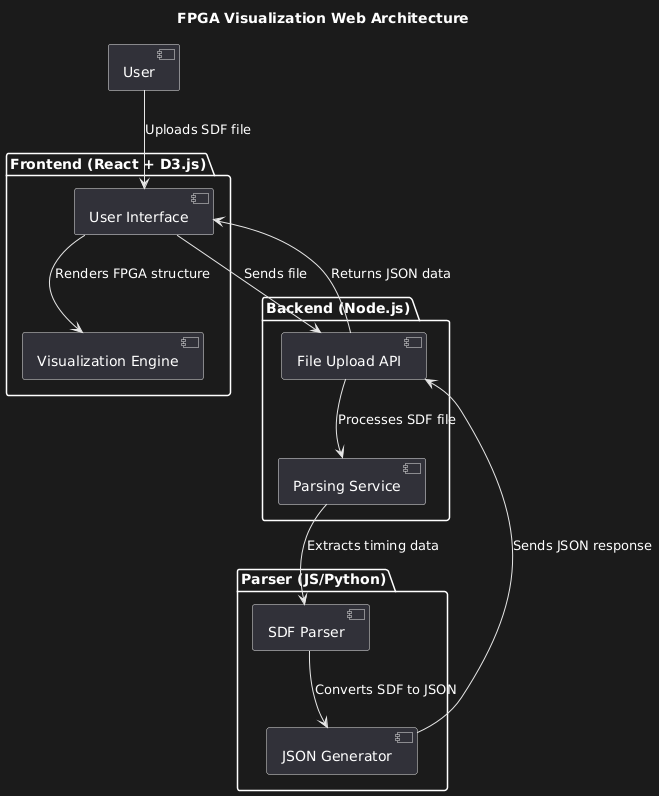

# Technical Specifications - Team 3

## Table of Contents

<details>
<summary>Click to expand</summary>

- [Technical Specifications - Team 3](#technical-specifications---team-3)
  - [Table of Contents](#table-of-contents)
  - [Introduction](#introduction)
    - [Objectives](#objectives)
    - [Why this project?](#why-this-project)
  - [Scope](#scope)
  - [Tasks split](#tasks-split)
    - [Task distribution](#task-distribution)
  - [Schedule](#schedule)
  - [Software](#software)
    - [Software architecture](#software-architecture)
    - [File and folder structure](#file-and-folder-structure)
    - [Website](#website)
      - [Frontend](#frontend)
  - [Risks and mitigation strategies](#risks-and-mitigation-strategies)
  - [Testing](#testing)
    - [Testing Strategy](#testing-strategy)

</details>

## Introduction

This project is a commission from the [CNES](https://cnes.fr/) (Centre National d'Études Spatiales), the French space agency.
The purpose of this project is to develop a web-based interface to visualize FPGA signal propagation. The target users include:

- **Teachers** who upload their FPGA designs and use the tool to teach their students.
- **Students** who interact with the simulator to observe and analyze FPGA behavior.

The system doesn't have any mandatory framework or library to use, but the team is free to use any of them. The only constraint is that the system must be web-based. It's the reason why the team chose to use the [React](https://reactjs.org/) library for the front end and the [D3.js](https://d3js.org/) library for the visualization part.

### Objectives

The main objective of this project is to provide an interactive 2D visualization of FPGA structures and signal routing. The system should be able to simulate signal propagation in real time with time-based animations, allowing users to see how signals travel through an FPGA design. Teachers should have the capability to upload Verilog applications and test benches, which students can then use to run and analyze simulations. The interface should be intuitive, engaging, and informative, making it easier for students to grasp the fundamentals of FPGA design and behavior.

### Why this project?

FPGAs are widely used in the aerospace industry for various applications, including satellite communication, image processing, and data acquisition. Understanding how FPGAs work is essential for engineers and researchers working in the aerospace sector. However, learning FPGA design can be challenging due to the complex nature of the hardware and software involved. By providing an interactive visualization tool, we aim to simplify the learning process and make it more accessible to students and teachers. This project aligns with CNES's mission to promote STEM education and foster innovation in the aerospace sector.

## Scope

The project is divided into two main parts:

1. **Front-end**: The web-based interface that users interact with. This includes the visualization of the FPGA structure and signal propagation, as well as the user interface for uploading and running simulations.
2. **Back-end**: The server-side application that handles file uploads, simulation execution, and communication with the front end.

| Item          | In Scope                                                                                                                                                                                          | Out of Scope                                                                                                                                                                                        |
| ------------- | ------------------------------------------------------------------------------------------------------------------------------------------------------------------------------------------------- | --------------------------------------------------------------------------------------------------------------------------------------------------------------------------------------------------- |
| **Front-end** | - Visualization of FPGA structures and signal propagation. <br> - User interface for uploading Verilog applications and testbenches. <br> - Manual simulation control (start, stop, pause, step). | - Advanced features like debugging, and waveform analysis. <br> - Support for complex FPGA architectures and designs. <br> - Real-time simulation of signal propagation with time-based animations. |
| **Back-end**  | - Handling Verilog file uploads and processing. <br> - Running FPGA simulations and sending results to the front end. <br> - Providing a REST API for communication with the front end.           | - Full-scale FPGA synthesis or hardware implementation. <br> - Integration with proprietary FPGA vendor tools.                                                                                      |

The project will be developed using the following technologies:

- **Front-end**: React, D3.js, HTML, CSS, JavaScript.
- **Back-end**: Node.js, JavaScript

## Tasks split

The project will be divided into the following tasks:

- **Parsing**: Being able to transform a given `.sdf` file into a JSON object that will be used to generate the FPGA structure.
- **FPGA Structure Generation**: Creating a 2D representation of the FPGA structure based on the JSON object generated from the `.sdf` file.
- **Signal Propagation Simulation**: Simulating signal propagation through the FPGA structure and updating the visualization in real time.
- **User Interface**: Designing an intuitive and interactive user interface for uploading Verilog applications, controlling simulations, and viewing results.
- **Back-end Development**: Implementing the server-side application to handle file uploads, simulation execution, and communication with the front end.
- **Integration**: Integrating the front-end and back-end components to create a seamless user experience.
- **Testing and Debugging**: Testing the system for bugs, performance issues, and usability problems, and fixing them as needed.
- **Documentation**: Writing technical documentation, user guides, and other relevant documentation for the project.

The team will work collaboratively on all tasks, with each member contributing to different aspects of the project based on their role and expertise. Regular meetings will be held to discuss progress, share updates, and address any issues that arise during development. The team will also reach the customer for feedback and validation of the deliverables.

The project is expected to be completed within the specified timeline, with regular updates provided to the customer to ensure alignment with their requirements and expectations.

### Task distribution

The tasks will be distributed among the team members as follows:

- **Parsing**: Camille (SE) and Julian (QA)
- **FPGA Structure Generation**: Camille (SE)
- **Signal Propagation Simulation**: Camille (SE) and Vivien (PGM)
- **User Interface**: Camille (SE) and Vivien (PGM)
- **Back-end Development**: Camille (SE) and Alexis (TL)
- **Integration**: Camille (SE), Vivien (PGM) and Alexis (TL)
- **Testing and Debugging**: Julian (QA) and Camille (SE)
- **Documentation**: Paul (TW), Julian (QA) and Camille (SE)

By doing so, each team member will work on multiple tasks, ensuring that everyone has a well-rounded understanding of the project and can contribute effectively to its success.

The team will follow an agile development approach, with regular sprints, stand-up meetings, and retrospectives to track progress, address issues, and make adjustments as needed. The team will also use version control and issue-tracking tools to manage the project and collaborate effectively.

## Schedule

The project will be developed over a period of 6 weeks, with the following milestones:

1. **Week 1**: Project Kickoff, Requirement Analysis, Task Distribution, and Planning.
2. **Week 2**: Parsing and FPGA Structure Generation
3. **Week 3**: Signal Propagation Simulation and User Interface
4. **Week 4**: Back-end Development and Integration
5. **Week 5**: Testing and Debugging, Documentation
6. **Week 6**: Final Testing, Deployment, and Delivery

## Software

The software will be implemented by using React. To do so, here are the initial steps:

1. In your cmd, go to the repository and press the following commands

```bash
npm create vite@latest
```

Once you're done with it, many questions will appear.

```bash
Need to install the following packages:
create-vite@4.1.0
Ok to proceed? (y)

Project name: Web-FPGA

Package name: web-fpga

Select a framework: React

Select a variant: JavaScript
```

Once you're done with it, the project will be created and you can start working on it.

2. To run the project, you can use the following command:

```bash
cd web-fpga
npm install
npm run dev
```

3. To build the project, you can use the following command:

```bash
npm run build
```

### Software architecture

The software architecture will be based on the following components:

- The website, a single-page application built with React, will provide the user interface for interacting with the FPGA simulator.
- The FPGA simulator, implemented in D3.js and JavaScript, will handle the simulation of signal propagation through the FPGA structure.
- The parser, written in JavaScript, will convert the `.sdf` file into a JSON object that can be used to generate the FPGA structure.
- The back-end server, built with Node.js, will handle file uploads, simulation execution, and communication with the front end.

Here's a look at the high-level architecture of the system:



The software architecture of this FPGA visualization web application is structured into three main components: the Frontend, the Backend, and the Parser. The front, built with React and D3.js, provides an interactive user interface where users can upload an SDF file and visualize the FPGA structure. Once a file is uploaded, it is sent to the Backend via an API.

The Backend, developed with Node.js, acts as an intermediary between the front end and the Parser. It receives the uploaded SDF file through the File Upload API and forwards it to the Parsing Service, which is responsible for extracting relevant timing and structural data from the file.

The Parser, implemented in JavaScript or Python, processes the SDF file, extracts information about timing constraints and component connections, and converts it into a JSON format that the front end can easily interpret. The Backend then returns this JSON data to the Frontend, which uses it to dynamically render the FPGA structure, allowing users to explore signal connections and propagation through an intuitive visualization.

This modular architecture ensures scalability, separation of concerns, and efficient processing of FPGA-related data, making it adaptable for future extensions and improvements.

### File and folder structure

The file and folder structure of the project will be organized as follows:

```plaintext
Web-FPGA/
├── public/
│   └── favicon.ico
├── src/
│   ├── components/
│   │   ├── Header.js
│   │   ├── Sidebar.js
│   │   ├── MainContent.js
│   │   └── Footer.js
│   ├── pages/
│   │   ├── MainPage.js
│   │   ├── UploadPage.js
│   │   ├── SimulationPage.js
│   │   └── ResultsPage.js
│   ├── services/
│   │   ├── api.js
│   │   ├── parser.js
│   │   └── simulator.js
│   ├── App.js
│   ├── index.js
│   └── styles.css
├── index.html
├── package.json
├── vite.config.js
├── README.md
└── .gitignore
```

> [!NOTE]
> I've deliberately omitted the `node_modules` folder, as there's no need to show it here. The same applies to the documentation folder.

The project will be structured into the following main directories:

- **public**: Contains static assets like `favicon.ico`.
- **src**: Contains the project's source code.
  - **components**: Contains reusable React components like `Header`, `Sidebar`, `MainContent`, and `Footer`.
  - **pages**: Contains the main pages of the application like `MainPage`, `UploadPage`, `SimulationPage`, and `ResultsPage`.
  - **Services**: Contains utility functions and services like `api`, `parser`, and `simulator`.
  - **App.js**: The main React component that renders the application.
  - **index.js**: The entry point of the application.
  - **styles.css**: Contains global styles for the application.
- **index.html**: The main HTML file that loads the React application.
- **package.json**: Contains project metadata and dependencies.
- **vite.config.js**: Contains configuration settings for the Vite build tool.

### Website

The goal of the website is to provide an intuitive and interactive user interface for uploading Verilog applications, running simulations, and visualizing FPGA structures and signal propagation.

#### Frontend

Based on the mockup approved by the customer, the frontend will consist of the following components:

- **Main content**: The main content area where the FPGA structure visualization will be displayed. This will include the FPGA grid, signal lines, and interactive components for controlling simulations such as arrows to move backward and forward in time.
- **Sidebar**: The sidebar area where logs will be displayed.
- **Header**: The header area with the project name and a button for uploading files.
- **Footer**: The footer area with copyright information and links to relevant resources.
- **Upload Form**: A dedicated form for uploading `.sdf` files that will appear when the user clicks the upload button in the header or at the start of the application.

## Risks and mitigation strategies

The project may face several risks during development, including technical challenges, resource constraints, and schedule delays. To mitigate these risks, the team has identified the following strategies:

1. **Technical Risks**: The team may encounter technical challenges related to parsing SDF files, simulating signal propagation, or integrating front-end and back-end components. To mitigate these risks, the team will conduct thorough research, seek expert advice, and leverage online resources to address technical issues as they arise.
2. **Resource Constraints**: The team may face resource constraints, such as limited access to hardware, software, or expertise. To mitigate these risks, the team will collaborate with the customer, leverage open-source tools and libraries, and seek external support if needed.
3. **Schedule Delays**: The project may experience delays due to unforeseen circumstances, such as technical setbacks, scope changes, or resource limitations. To mitigate these risks, the team will maintain regular communication, track progress, and adjust the project plan as needed to ensure timely delivery.

By identifying potential risks and implementing mitigation strategies, the team aims to minimize the impact of unforeseen challenges and ensure the successful completion of the project.

## Testing

The testing of the project will be done using the following tools:

- **Jest**: For unit testing of individual components and functions.
- **React Testing Library**: For integration testing of React components and user interactions.
- **Cypress**: For end-to-end testing of the entire application flow, including file uploads, simulations, and visualizations.
- **Postman**: For testing the REST API endpoints and verifying data exchange between the front-end and back-end.
- **Manual Testing**: For exploratory testing, usability testing, and edge case scenarios that may not be covered by automated tests.

### Testing Strategy

The testing strategy will be based on the following principles:

- **Test Early, Test Often**: Testing will be integrated into the development process from the beginning, with unit tests written for individual components and functions as they are implemented.
- **Automate Where Possible**: Automated tests will be used to validate critical functionality, reduce manual effort, and ensure consistent test coverage across the application.
- **Test Coverage**: The team will strive to achieve high test coverage, focusing on key features, edge cases, and error scenarios to ensure the reliability and robustness of the application.
- **Regression Testing**: Regression tests will be run regularly to detect and prevent regressions, ensuring that new changes do not introduce unintended side effects or break existing functionality.
- **User-Centric Testing**: Usability testing, accessibility testing, and user feedback will be incorporated into the testing process to validate the user experience and address usability issues early in the development cycle.
