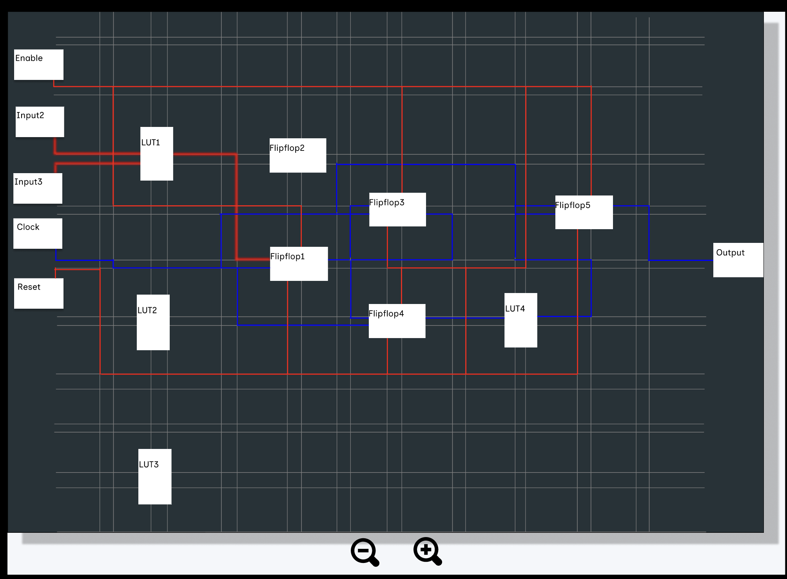
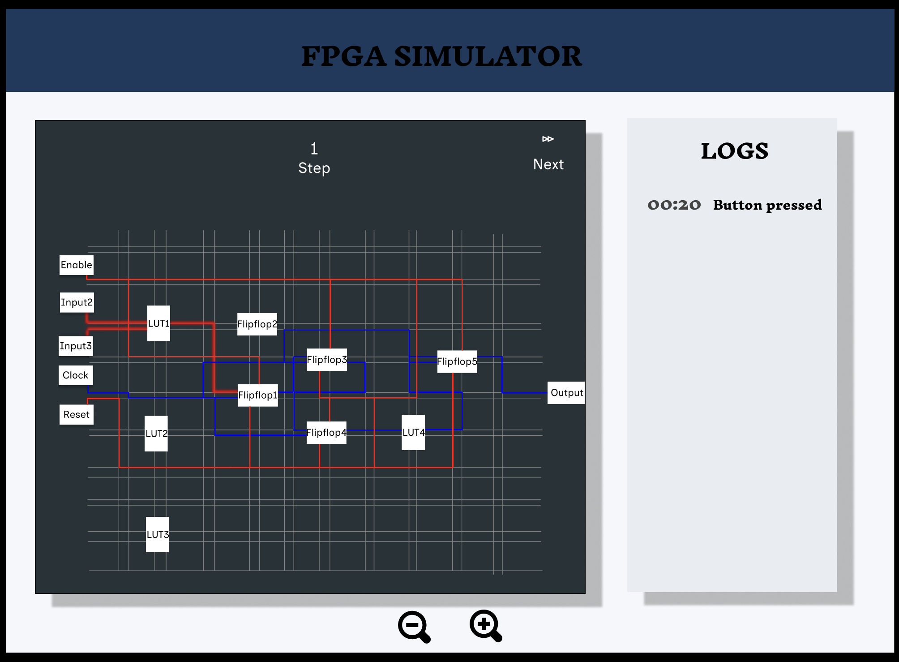
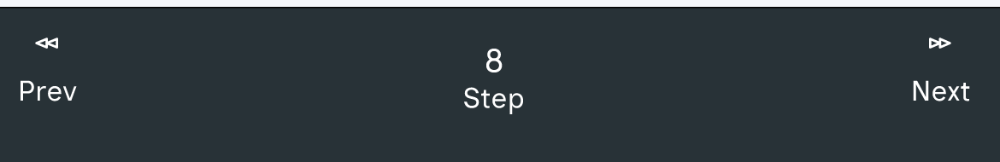
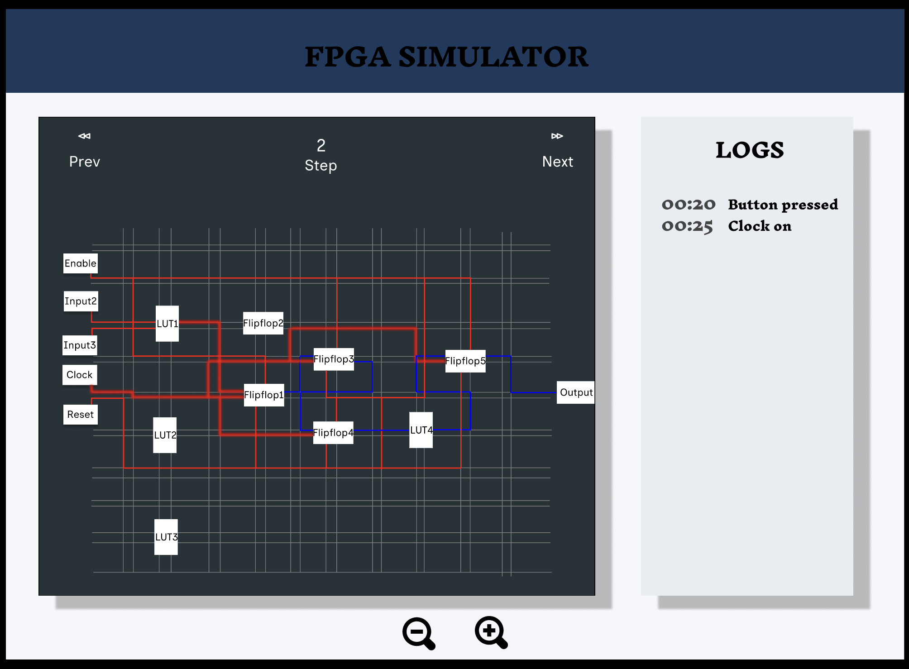
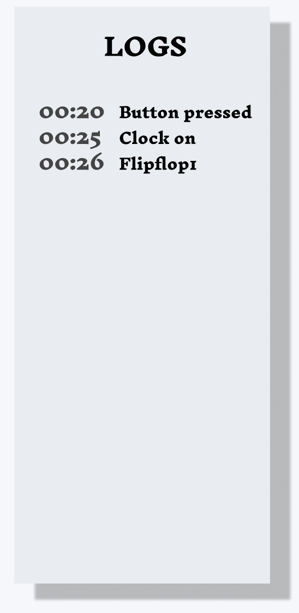

# Functional Specification Document 

---

Contents 📋

## Table of contents

---

## Web Interface for FPGA Simulator

## 1. Introduction

### 1.1 Purpose
This document outlines the functional specifications for a web interface that visualizes signal propagation inside an FPGA (Field-Programmable Gate Array). The primary purpose of this software is educational, allowing students to observe and understand how signals propagate through an FPGA's components on a user-friendly web interface.

### 1.2 Project Scope
The project involves developing a web application that:
- Displays a 2D representation of an FPGA's layout after synthesis and Place & Route (P&R)
- Animates signal propagation through the FPGA's Basic Elements (BELs) and interconnections
- Allows users to control simulation (next, prev)
- Provides navigation tools (zoom, pan) for exploring the FPGA layout
- Includes a backend system for teachers to add example applications and testbenches

### 1.3 Intended Audience
This specification is intended for:
- Development team responsible for implementing the web interface
- Teachers who will use the backend to create educational content
- Stakeholders reviewing the project requirements and deliverables
- Students who will interfere with the frontend to see how signal is flowing in an FPGA

## 2. System Overview

### 2.1 System Architecture
The system will consist of two main components:

1. **Frontend Web Interface**
  - Browser-based application for students
  - Interactive 2D visualization of FPGA layout
  - Simulation controls
  - Navigation tools for the 2D view

2. **Backend System**
  - Processing pipeline for verilog applications and testbenches
  - API for the frontend to access simulation data
  - Teacher interface for adding new examples

### 2.2 User Roles

#### 2.2.1 Student
Students will use the web interface to:
- Select from preloaded application examples
- View the 2D representation of the FPGA layout
- Control the simulation playback (play, pause, speed)
- Navigate the 2D view (zoom, pan)
- Observe signal propagation through the FPGA

#### 2.2.2 Teacher
Teachers will use the backend interface to:
- Upload verilog applications and testbenches
- Create educational content for students

## 3. Functional Requirements(FR)

### 3.1 Frontend Web Interface (Student Use)

#### 3.1.1 Application Selection
- **FR-1.1**: The interface will display a loaded application example.
- **FR-1.2**: Users shall be able to interact with no problem with the interface.

#### 3.1.2 2D Visualization
- **FR-2.1**: The interface shall display a 2D representation of the FPGA layout showing:
  - Basic Elements (BELs) used by the application
  - Signal routes between BELs
  - Current state of signals (active/inactive)
- **FR-2.2**: BELs shall be visually distinguishable by type (flipflop, LUT).
- **FR-2.3**: Signal routes shall be visible and distinguishable from BELs.
  - BELs shall be display in block, while signal shall be display in line.
    - **Flipflop:** Display in a horizontal rectangular form.
    - **LUT:** Display in a vertical rectangular form
    - **Signals:** Display in vertical and horizontal lines
- **FR-2.4**: Active signals shall be visually highlighted during simulation.
  - Inactive signals shall be display in gray(**color: #808080**)
  - Signal path from input to output shall be display in blue(**color: #0000FF**)
  - Current active signal state in the simulation shall be display is red with a layer shadow effect(**color: #FF0000**)

  

#### 3.1.3 Navigation Controls
- **FR-3.1**: Users shall be able to zoom in and out of the 2D view.
  - The zoom button with positive sign is for zoom in whereas the other one with negative sign is for zoom out
    

  - **ZOOM-IN:**
    

  - **ZOOM-OUT:**
     

- **FR-3.2**: Users shall be able to through the simulation process step by step around the 2D view.
    
  
  
  - **Steps:** Guide you to know where precisely at which level you are in the simulation
  - **Prev:** Permit you to see the previous step of the simulation
    
  - **Next:** Helps you to go to the next step of the simulation
    
  

**NB:** This mockup images is the first version of our simulation representing how the interface will be display, but some slight modification shall be made during the 
      implementation phase. Here under are keypoint to take into consideration during the implementation phase.

- **Improve View Clarity:**
  - Wires between elements will be grouped horizontally and vertically to maintain a clean and organized layout. 
  - Elements like **Enable and Reset** will be removed to improve clarity, 

- **Element Identification:**
  - Row and column numbers will be placed on the borders for element identification, avoiding placement inside the elements to prevent display clutter.

- **Refine Transition Animation:**
  - The transition animation will be refined to accurately represent signal propagation through the wires. The blur effect will be adjusted to better illustrate signal movement. Instead of using only the red color, a mix of red and green color of 1mm each on active signal line.

- **Distinguish Input/Output Elements:**
  - Input and output elements will be treated as distinct entities, similar to flip-flops and LUTs. They will not be mixed with names like clock, enable, or reset to maintain clear categorization.
  
#### 3.1.4 Simulation Controls
The simulation will be control manually, there will be no automatically display of current flow in the simulation. The **next and prev** button will be use t navigate throughout the simulation.

#### 3.1.5 Information Display
- **FR-5.1**: The interface shall display the current simulation time.
- **FR-5.3**: The interface shall provide information of what is happening at each step.
- **FR-5.4**: Optional: The interface may display a timeline of signal changes.
  

### 3.2 Backend System (Teacher Use)

#### 3.2.1 Application Upload
- **FR-6.1**: Teachers shall be able to upload verilog application files.
- **FR-6.2**: Teachers shall be able to upload verilog testbench files.
- **FR-6.3**: The system shall validate uploaded files for format correctness.

#### 3.2.2 Processing Pipeline
- **FR-7.1**: The backend shall process uploaded verilog files to generate required simulation data.
- **FR-7.2**: The backend shall generate a 2D representation of the FPGA layout from the processed data.
- **FR-7.3**: The backend shall calculate signal propagation timing based on the Standard Delay File (SDF).
- **FR-7.4**: The backend shall store processed data in a format accessible by the frontend.

#### 3.2.3 Example Management
- **FR-8.1**: Teachers shall be able to add new examples to the system.
- **FR-8.2**: Teachers shall be able to edit metadata for existing examples.
- **FR-8.3**: Teachers shall be able to remove examples from the system.
- **FR-8.4**: Teachers shall be able to organize examples into categories.

#### 3.2.4 Intermediary File Format
- **FR-9.1**: The system shall define an intermediary pivot file format to bridge between backend processing and frontend visualization.
- **FR-9.2**: The format shall include:
  - FPGA layout information (BEL positions and types)
  - Signal route information
  - Signal propagation timing data
  - Simulation event sequence

### 4. Use Cases

#### 4.1 Use Case: Running a Simulation
| **Use Case ID** | UC-01 |
|----------------|--------|
| **Actors** | Student |
| **Preconditions** | The teacher has preloaded application examples. |
| **Description** | The student selects an application and runs the simulation. |
| **Postconditions** | The FPGA layout is visualized, showing signal propagation. |
| **Alternative Flows** | Student pauses/resumes simulation mid-run. |

#### 4.2 Use Case: Uploading a Verilog Application
| **Use Case ID** | UC-02 |
|----------------|--------|
| **Actors** | Teacher |
| **Preconditions** | The teacher has a Verilog file and testbench. |
| **Description** | The teacher uploads the files, which are processed for visualization. |
| **Postconditions** | The application is available for students. |
| **Alternative Flows** | System rejects incompatible files and provides error messages. |

#### 4.3 Use Case: Exporting Simulation Data
| **Use Case ID** | UC-03 |
|----------------|--------|
| **Actors** | Student, Teacher |
| **Preconditions** | A simulation has been completed. |
| **Description** | The user exports results for offline analysis. |
| **Postconditions** | Data is downloaded in a structured format. |

### 5. Personas

#### 5.1 Persona: Alex (The Student)
- **Role:** Engineering Student
- **Experience:** Basic digital electronics knowledge

- **Goals:**
  - Understand FPGA signal propagation
  - Visualize routing mechanisms
  - Practice with different examples
  - Self-paced learning

- **Pain Points:**
  - Abstract concepts difficult to grasp
  - Limited hands-on experience
  - Need for interactive learning tools

#### 5.2 Persona: Dr. Smith (The Teacher)
- **Role:** FPGA Course Instructor
- **Experience:** 15+ years teaching digital electronics

- **Goals:**
  - Upload and manage FPGA examples
  - Create comprehensive learning materials
  - Monitor student progress
  - Demonstrate complex FPGA concepts

- **Pain Points:**
  - Time-consuming setup of examples
  - Difficulty in explaining dynamic concepts
  - Limited visual tools for demonstration

## 6. Non-Functional Requirements

### 6.1 Performance Requirements
- **NFR-1.1**: The web interface shall load within 5 seconds on a standard broadband connection.
- **NFR-1.2**: The simulation animation shall run smoothly without noticeable lag.
- **NFR-1.3**: The system shall support at least 50 concurrent users.

### 6.2 Usability Requirements
- **NFR-2.1**: The interface shall be intuitive and require minimal training for students.
- **NFR-2.2**: The interface shall be compatible with major web browsers (Chrome, Firefox, Safari, Edge).
- **NFR-2.3**: The interface shall be responsive and usable on devices with screens of at least 1024x768 resolution.

### 6.3 Reliability Requirements
- **NFR-3.1**: The system shall have an uptime of at least 99%.
- **NFR-3.2**: The system shall handle unexpected input without crashing.
- **NFR-3.3**: The system shall provide appropriate error messages for common issues.

### 6.4 Security Requirements
- **NFR-4.1**: The backend shall implement authentication for teacher access.
- **NFR-4.2**: The system shall validate all user inputs to prevent injection attacks.
- **NFR-4.3**: The system shall implement appropriate access controls to prevent unauthorized file access.

## 7. Data Model

### 7.1 FPGA Layout Model
- BEL representation (type, position, state)
- Signal route representation (path, connected BELs)
- FPGA grid coordinates system

### 7.2 Simulation Model
- Time-based events for signal changes
- Signal propagation timing data
- BEL state changes over time

### 7.3 User Data Model
- Example metadata (name, description, category)
- User preferences for interface settings

## 8. User Interface Design

### 8.1 Main Interface Layout
The main interface will consist of the following components:
- Example selection panel (left sidebar)
- 2D visualization canvas (main area)
- Navigation controls (bottom right corner)
- Simulation controls (bottom center)
- Information panel (right sidebar)

### 8.2 Interface Wireframes
Wireframes for key interfaces should be included:
- Main student interface
- Example selection interface
- Teacher upload interface
- BEL information display

## 9. Technical Implementation Considerations

### 9.1 Frontend Technologies
- Web framework options (React, Vue.js, Angular)
- Canvas rendering options (SVG, HTML5 Canvas, WebGL)
- UI component libraries

### 9.2 Backend Technologies
- Server-side programming language options
- Database options
- Processing pipeline integration options

### 9.3 Integration Points
- Integration with FPGA tools (`Impulse`, `yosys`, `VPR`)
- File format conversions (verilog, SDF)
- API endpoints for frontend-backend communication

## 10. Prototype Implementation Plan

### 10.1 Initial Examples
The system shall be delivered with at least two working examples:
1. **Flipflop Example**
  - Demonstration of signal propagation through flipflops
  - Simple clock-driven circuit

2. **LUT4 Example**
  - Demonstration of signal propagation through Look-Up Tables
  - Logic implementation example

### 10.2 Development Phases
1. **Phase 1: Core Visualization**
  - Basic 2D rendering of FPGA layout
  - BEL and route representation

2. **Phase 2: Simulation Engine**
  - Integration of timing data
  - Signal propagation animation

3. **Phase 3: User Controls**
  - Playback controls
  - Navigation tools

4. **Phase 4: Backend Integration**
  - Teacher upload interface
  - Processing pipeline

## 11. Testing Strategy

### 11.1 Functional Testing
- Verification of all functional requirements
- User acceptance testing with teachers and students

### 11.2 Performance Testing
- Load testing for concurrent users
- Animation performance testing

### 11.3 Usability Testing
- Student interface usability testing
- Teacher interface usability testing

## 12. Deployment and Maintenance

### 12.1 Deployment Options
- Server requirements
- Containerization possibilities
- Cloud deployment options

### 12.2 Documentation Requirements
- Source code documentation
- User manuals for students and teachers
- How-To guides for adding new examples

## 13. Appendices

### 13.1 Glossary of Terms
- FPGA: Field-Programmable Gate Array, an integrated circuit with basic elements and preconfigured electrical signal routes between them. The selected FPGA is a NanoXplore NGultra (with VTR flow a basic Xilinx serie 7 model).
- BEL: Basic Element, the hardware electrical resources available inside the FPGA like flipflop, Look-Up-Table (LUT), Block RAM.
- Application: The function to be executed in the FPGA (developed in verilog).
- Synthesis: Translation of the application into an electrical equivalent. It creates a netlist. The tool used will be Impulse (or yosys in VTR flow).
- P&R: Place and Route, the packing of the netlist component in the FPGA available BEL (Place) followed by selection of routes for signals between each BEL (Route). The tool used will be Impulse (or VPR for VTR flow).
- Simulator: Compiles verilog testbenches and applications and executes the simulation of every signal with regard to time evolution. The tool used will be Modelsim (using icarus verilog for VTR flow).
- Software: The web application developed in the frame of this call for tender.

### 13.2 References
- DigitalJS project: https://digitaljs.tilk.eu/
- Verilog to routing: https://github.com/verilog-to-routing/vtr-verilog-to-routing
- OSSCAD project: https://github.com/YosysHQ/oss-cad-suite-build
- YoWASP: https://yowasp.org/
- Python SDF-timing library: https://github.com/chipsalliance/f4pga-sdf-timing